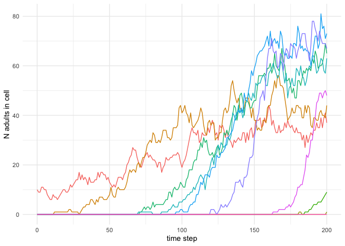
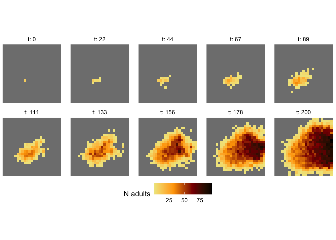

<!-- README.md is generated from README.Rmd. Please edit that file -->

# stranger: spatiotemporal range simulation in R

<!-- badges: start -->
<!-- badges: end -->

This R package provides tools for simulating species range dynamics.
Range simulations combine a demographic module that simulates local
population change, and a dispersal module that simulates movement among
grid cells.

## Installation

You can install the development version of stranger from
[GitHub](https://github.com/) with:

``` r
# install.packages("devtools")
devtools::install_github("matthewkling/stranger")
```

If you’re on MacOS and encounter compilation errors when attempting to
install the package, installing the [latest version of
gfortran](https://github.com/fxcoudert/gfortran-for-macOS/releases) may
solve the issue.

## Example

In this toy example we’ll run a range simulation for an imaginary plant
species. We’ll use a stage-based population matrix model representing
three life history stages: seeds, juveniles, and adults.

#### Input data

First we’ll mock up some spatial data. The convenience function
`landscape_template` generates a skeleton object with the necessary data
structure, a list with two components. The first piece, `n`, is a 3-D
array of initial population sizes for each life history stage for each
spatial grid cell; here we’ll start with 10 adults in one of the grid
cells. The second piece, `e`, is a 4-D array of environmental data,
which maximally can include multiple environmental variables that vary
spatially and temporally; in this example we’ll use a single,
time-invariant environmental grid with values ranging in a spatial
gradient from 0 to 1.

``` r
library(stranger)

stages <- c("s", "j", "a") # names for life history stages
ls <- landscape_template(n_row = 25, n_col = 25, names = stages) # spatial data template
ls$n[10,10,3] <- 10 # start with 10 adults in one grid cell
ls$e[,,,] <- seq(0, 1, length.out = prod(dim(ls$e))) # set environmental values
```

#### Species parameters

The other input to the simulation is a set of parameters representing
the species’ biology. This includes demographic parameters and dispersal
parameters. Here we’ll use `species_template` to create a parameter
object, and then set some of the parameter values to fit our species.

For this matrix model, the demographic parameters represent
probabilities of transitioning from one stage to another at each time
step; these probabilities can be constant, or they can vary as a
function of population levels (density dependence) or environmental
values (environmental dependence). A given transition probability is
calculated as the intercept term from the `alpha` matrix, plus the
coefficients from the `beta` array multiplied by population levels, plus
coefficients from the `gamma` array multiplied by environmental values.
(Note that for the current package version, the fecundity parameter
`["a", "s"]` is the one component that’s not a probability.) In this
example we’ll make juvenile survival depend on the environment, and
we’ll make juvenile-adult transitions depend on the number of adults.

The other parameters control dispersal distances. Users can supply any
arbitrary probability density function, but for now we’ll stick with the
lognormal distribution included in the template and just modify its
parameter values.

``` r
sp <- species_template(n_env = dim(ls$e)[4], names = stages)

# invariant transitions
sp$alpha["s", "j"] <- .01
sp$alpha["a", "s"] <- 200
sp$alpha["a", "a"] <- .9

# environmentally dependent juvenile survival
sp$alpha["j", "j"] <- 0
sp$gamma["j", "j", "v1"] <- 1

# density dependent juvenile-adult transition
sp$alpha["j", "a"] <- .1
sp$beta["j", "a", "a"] <- -.001

# parameters for lognormal dispersal kernel
sp$kernel$L <- .2
sp$kernel$S <- 2
```

#### Simulation

Using these landscape and species inputs, we can now `simulate` range
dynamics over time. At each time step, the species goes through a
demographic transition and dispersal occurs.

``` r
d <- simulate(sp, ls, # data and parameter inputs from above
              n_steps = 200, # number of iterations to simulate 
              record = 3) # record populations for life stage 3 (adults)
```

The result is an array of adult populations over space and time. The
first plot below shows population time series for 10 random grid cells,
and the second shows snapshots of spatial population patterns over time.


